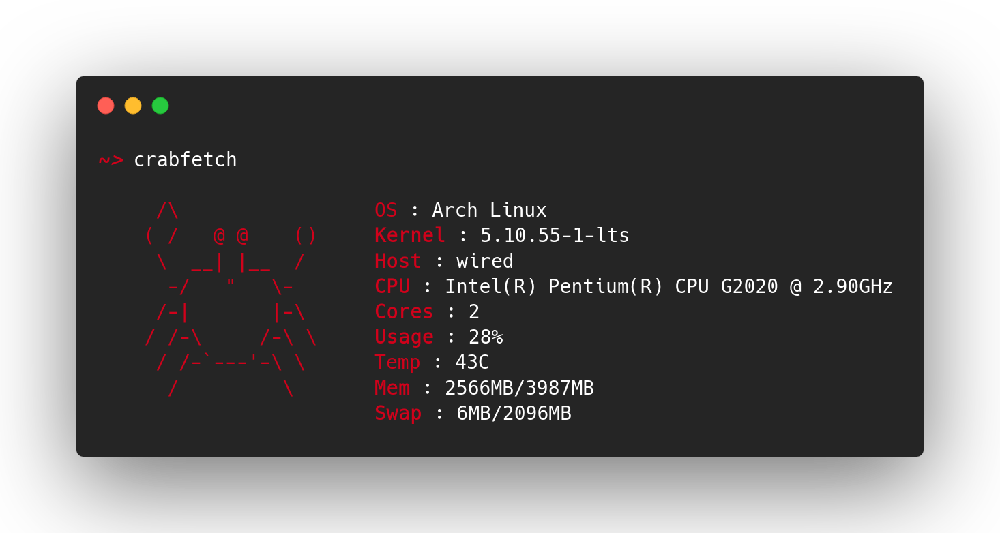

# crabfetch 🦀

A simple fetch utility, written in Rust

[](https://forthebadge.com)


[](https://forthebadge.com) [](https://forthebadge.com)



## This app is
- written in rust
- blazing fast
- written in rust
- post modern (because, why not)
- written in rust
- correct (must be, cuz its Rust)
- written in rust
- better than whatever go can make
- written in rust
- most memory safe app ever
- next gen (ofc)
- written in rust
- open source (bruh!)
- written in rust

## Install

### AUR (Arch and Arch Based)

Install [`crabfetch`](https://aur.archlinux.org/packages/crabfetch) from AUR.

### Manual

[](https://github.com/flyingcakes85/crabfetch/actions/workflows/rust.yml)

1. Get the repo

```sh
git clone https://github.com/flyingcakes85/crabfetch
cd crabfetch
```

2. Build it!

```sh
cargo build --release
```

3. Copy the binary

- For current user (root not required)
```sh
cp target/release/crabfetch ~/.local/bin/crabfetch
```

## License

GNU GPL v3. [Text Here](https://github.com/flyingcakes85/crabfetch/blob/main/COPYING)
